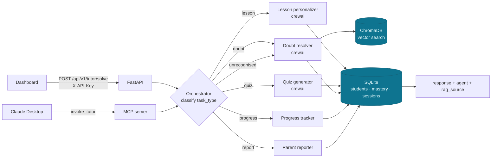
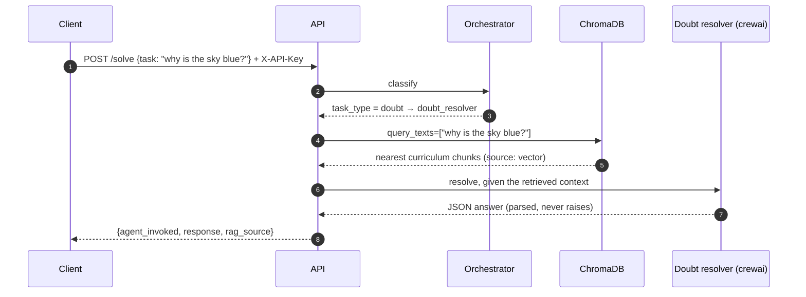

# Lumina AI

[](https://github.com/daniellopez882/Next-Gen-AI-Agent-Tutor-Ecosystem/actions/workflows/ci.yml)


A tutoring agent. An orchestrator classifies a request and routes it to one of
five specialists — lesson personalizer, quiz generator, doubt resolver,
progress tracker, parent reporter — over a LangGraph workflow, with crewai
running the generative agents and a ChromaDB vector store backing the doubt
resolver. It is reachable as an HTTP API with a dashboard, and as an **MCP
server** a client such as Claude Desktop can call.

## At a glance

| | |
|---|---|
| **Does** | Classify → route → run one specialist; retrieve curriculum context (real vector search) for doubts; persist students, mastery and sessions in SQLite |
| **MCP** | Genuine: `mcp_server.py` exposes `invoke_tutor` over FastMCP, sharing the graph and database with the API |
| **Guarded** | `X-API-Key` on the tutor endpoint; task and profile validated; CORS allowlist; production refuses the placeholder key |
| **Tests** | 52 — none reach a model provider or the network; the vector store is exercised for real |
| **CI** | lint · tests on 3.11/3.12 · the endpoint asserted to reject an unauthenticated call · bandit · gitleaks · container built, non-root, health-checked |

## Architecture



### One doubt, with retrieval



## Quick start

```bash
python -m venv .venv && . .venv/bin/activate     # Windows: .venv\Scripts\activate
pip install -r requirements.txt
cp .env.example .env          # set API_KEY and one provider key
uvicorn main:app --reload
```

Open <http://127.0.0.1:8000/>, enter the `API_KEY` in the sidebar, ask a
question. As an MCP server for Claude Desktop:

```json
{ "mcpServers": { "lumina": { "command": "python", "args": ["mcp_server.py"] } } }
```

### Container

```bash
docker build -t lumina .
docker run --rm -p 8000:8000 --env-file .env -v lumina-data:/app/data lumina
```

## Configuration

| Variable | Default | Notes |
|---|---|---|
| `API_KEY` | `changeme-in-production` | Required by the tutor endpoint; production refuses the placeholder |
| `CORS_ALLOW_ORIGINS` | *(empty)* | The app serves its own page; set only for a page hosted elsewhere. Never a wildcard |
| `OPENAI_API_KEY` · `OPENAI_MODEL` | — · `gpt-4o` | Preferred provider |
| `ANTHROPIC_API_KEY` · `ANTHROPIC_MODEL` | — · `claude-sonnet-5` | Used when OpenAI is unset |
| `DB_PATH` · `CHROMA_PATH` | `tutor.db` · `chroma_db` | SQLite and vector store |
| `MAX_TASK_CHARS` · `LLM_TIMEOUT_SECONDS` | `2000` · `60` | |

## What changed, and why

Every defect below was reproduced before it was fixed.

| # | Defect | Effect |
|--:|---|---|
| 1 | The vector store was seeded and never queried; retrieval was keyword matching over four hardcoded sentences | "Full RAG" that did no retrieval; `"math"` matched "aftermath" |
| 2 | `/api/v1/tutor/solve` was unauthenticated | Anyone reaching the port could spend the model credit |
| 3 | `task` was unbounded | One request could carry an arbitrary string into a model call |
| 4 | `allow_origins=["*"]` with `allow_credentials=True` | Any browser origin could call the endpoint |
| 5 | `detail=str(e)` on the 500 | Provider and internal exception text to the caller |
| 6 | `claude-3-5-sonnet-20240620` and `gpt-4o` hardcoded in three factories; `mock_key` fallback | A retired model; a "no key" run failed deep inside crewai |
| 7 | Six copies of `.replace('```json','')` + `json.loads` | A reply with prose around its JSON silently fell back to the doubt resolver |
| 8 | `database.init_db()` and the ChromaDB seed ran at import | Importing any module created files and spun up the vector store |
| 9 | The frontend rendered user and model text with `innerHTML` unescaped | A task containing HTML — or a model echoing it — ran in the browser |
| 10 | The page hardcoded `http://127.0.0.1:8000` and sent no key | It worked only next to a dev server, and would 401 once auth existed |

## Design notes

| Record | Decision |
|---|---|
| [ADR 0001](docs/adr/0001-the-rag-actually-retrieves.md) | The RAG actually queries the vector store |
| [ADR 0002](docs/adr/0002-the-tutor-endpoint-is-guarded.md) | The tutor endpoint is authenticated and bounded; one place builds models |
| [Threat model](docs/threat-model.md) | Assets, seven threats, including data about minors |

## Layout

```
main.py                    FastAPI: auth, limits, lifespan, /health, /ready, dashboard
config.py                  settings, validate_production()
llm.py                     LangChain + crewai model factories; the test seams
json_extraction.py         the one JSON extractor
agent_graph.py             orchestrator + five specialist nodes
crew_agents.py             the three crewai agents
rag_pipeline.py            ChromaDB retrieval, with a labelled keyword fallback
database.py                SQLite: students, mastery, sessions
mcp_server.py              the MCP tool (invoke_tutor)
education_tutor_prompts.py the agent prompts
frontend/                  the dashboard, served at /
tests/                     52 tests
docs/                      ADRs, threat model
```

## Limits

- Single tenant, one shared API key, no rate limit.
- Student records (about minors) persist in SQLite with no encryption beyond filesystem permissions and no retention policy — deploy accordingly.
- Generated lessons, quizzes and reports are not reviewed before a student sees them.
- Nothing here has been run against a model provider; the tests use scripted models and the real vector store.

## Licence

MIT — see [LICENSE](LICENSE).
